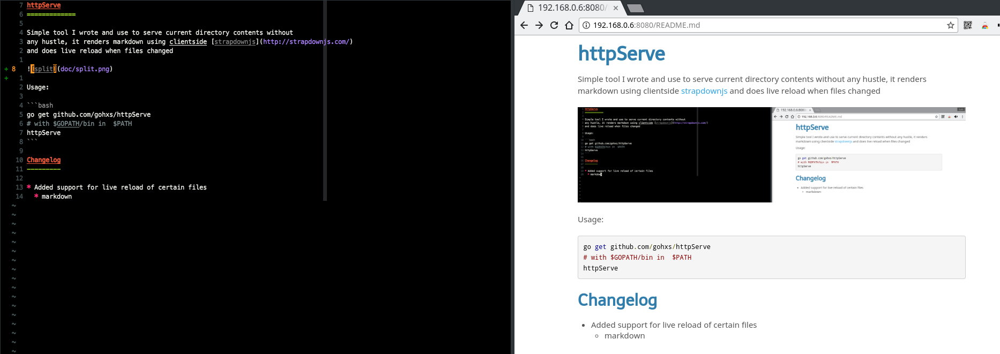

# httpServe

Simple tool I wrote and use to serve current directory contents without
any hassle, it renders markdown using clientside [strapdownjs](http://strapdownjs.com/)
and does live reload when files changed



Usage:

```bash
go get github.com/gohxs/httpServe
# with $GOPATH/bin in  $PATH
httpServe
```

## Changelog

* Added support for live reload of certain files
  * markdown
* Render graphviz with viz.js for `dotg` language in code blocks
* Server rendering blackfriday
* Added .css to watcher for custom styled markdown hot reloading

## Todo

* ~~Consider using server side markdown https://github.com/russross/blackfriday~~
